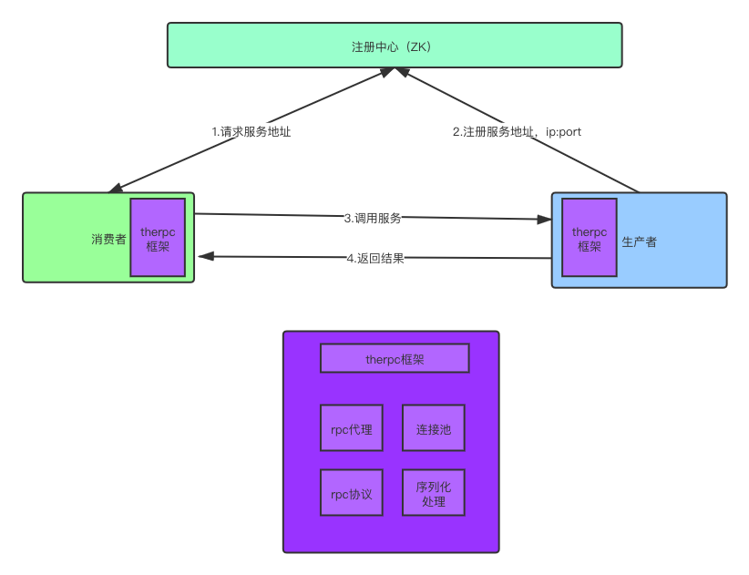

# therpc

基于 Netty 的轻量级 RPC 框架。

## RPC 原理

RPC：Remote Procedure Call，远程服务调用。

### 图解

## 实现

- RPC 的基础功能：产者提供服务，消费者消费服务。
- RPC 消息协议的设计与编码解码和序列化处理。
- RPC 消费者连接池。
- tps 可达到 60000/s。

## TODO

- 使用 ZooKeeper 设计/实现注册中心
- 为服务提供可配置选项，如：连接数、重试次数和别名（alias）。
- 整理框架打包发布Maven

